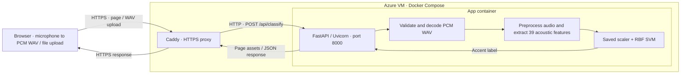

# Singapore English Accent Classification

A web demo that records microphone audio or accepts a PCM WAV upload and returns **Singapore accent** or **Non-Singapore accent**, using a trained 39-feature RBF SVM classifier. The frontend uses HTML, CSS and JavaScript; the backend uses FastAPI.

[Open the hosted demo](https://singlish-demo-4e04e8d0.eastasia.cloudapp.azure.com/).

## Prerequisites

Python 3.12 or later is required; Python 3.14 matches the deployment environment. Dependencies are pinned in `mvp/requirements.txt`; the model manifest records the artifact's serving environment. The commands below use Bash on Linux or macOS.

The trained model binary is not included in Git. Obtain the trusted `svm_39.joblib` artifact from the project maintainers and place it at `mvp/models/svm_39.joblib`. It must match the checksum and model contract in `mvp/models/manifest.json`. Startup rejects a missing, incompatible or mismatched artifact.

## Setup

From the repository root:

```bash
python3 -m venv mvp/.venv
mvp/.venv/bin/python -m pip install -r mvp/requirements.txt
```

## Run

From the repository root:

```bash
./mvp/run.sh
```

Open **http://127.0.0.1:8000**. The local server binds to localhost. To use a different port:

```bash
PORT=8001 ./mvp/run.sh
```

## Using the demo

- **Record:** select **Record audio**, allow microphone access, speak, then select **Stop recording**. Recording stops automatically at 10 seconds. **Cancel** discards the new take and preserves any previously selected audio.
- **Upload:** choose or drop a PCM WAV file.

Listen to the preview, then select **Classify recording**. The result includes the predicted accent class and recording duration. Model information is available under **Model details**.

Microphone recording requires a browser with MediaRecorder and Web Audio support, microphone permission, and HTTPS or localhost. The browser converts captured audio to mono 16-bit PCM WAV before classification. Switching tabs, backgrounding the browser or leaving the page cancels an active recording and releases the microphone. Stopping or cancelling also releases it. Audio is sent to the server only when **Classify recording** is selected; WAV upload remains available if recording is unsupported or permission is denied.

Use 3–6 seconds of clear English speech from one speaker. Recordings must be uncompressed PCM WAV, no larger than 10 MiB or 10 seconds. Mono and stereo recordings at other sample rates are supported. The server validates the file content, not just its filename.

Upload and result panels appear side by side on desktop and stack on mobile and tablet.

## System design

The hosted demo runs on an Azure VM using Docker Compose. Caddy provides HTTPS, and FastAPI serves both the web page and the classification API.



Audio is processed per request and not retained. The application does not require a database. See [Azure deployment](deploy/azure/README.md) for hosting details.

## Model behavior and limitations

The backend uses the `librosa39-v1` extractor: mono 16 kHz → boundary trimming at 30 dB → peak normalization → padding to at least one second → first six seconds → 39 acoustic features. The saved pipeline contains the fitted scaler and SVM; no training occurs in the app. Very short recordings and six-second cropping produce warnings.

The classifier returns a binary label without a confidence percentage. It classifies accent characteristics, not nationality or identity, and results may be incorrect. It cannot confirm that a recording contains English speech or reliably reject noise and music. The current MVP does not provide transcription, speech detection or audio quality scoring.

## API

- `GET /` — recording and upload page.
- `GET /api/health` — readiness and model version.
- `POST /api/classify` — multipart form containing exactly one `audio` file.

Example using a local WAV file:

```bash
curl -F 'audio=@recording.wav' http://127.0.0.1:8000/api/classify
```

Success returns `prediction` (`class_id`, `label`, `display_label`), `audio` (`duration_seconds`, `classified_duration_seconds`, `truncated`), `warnings`, and `model_version`. Classified duration excludes artificial padding and refers to the trimmed/cropped signal, not verified speech duration.

Errors return `error.code` and `error.message`: 413 for size limits, 415 for unsupported formats or encodings, 422 for invalid requests/audio or excessive duration, and 500 for unexpected inference failure.
