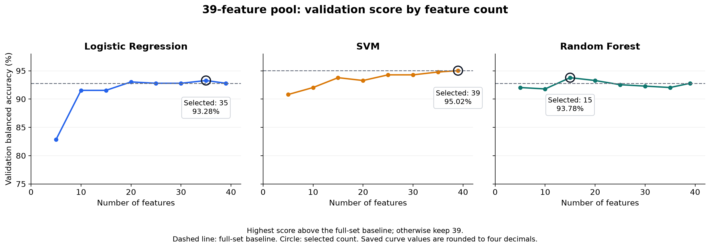
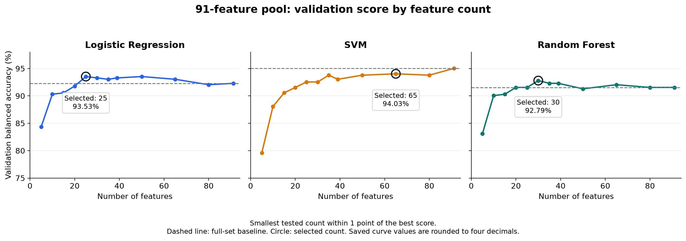
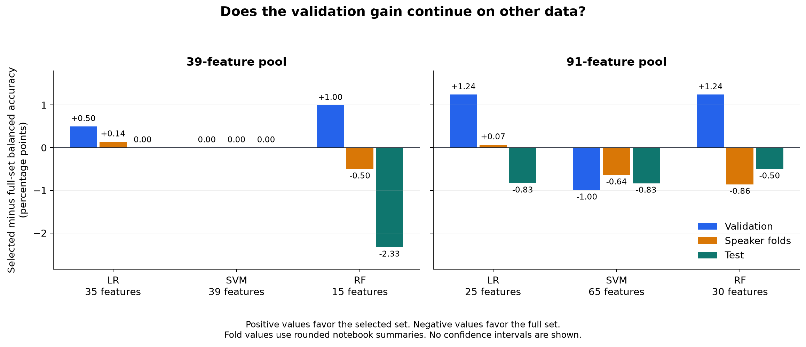
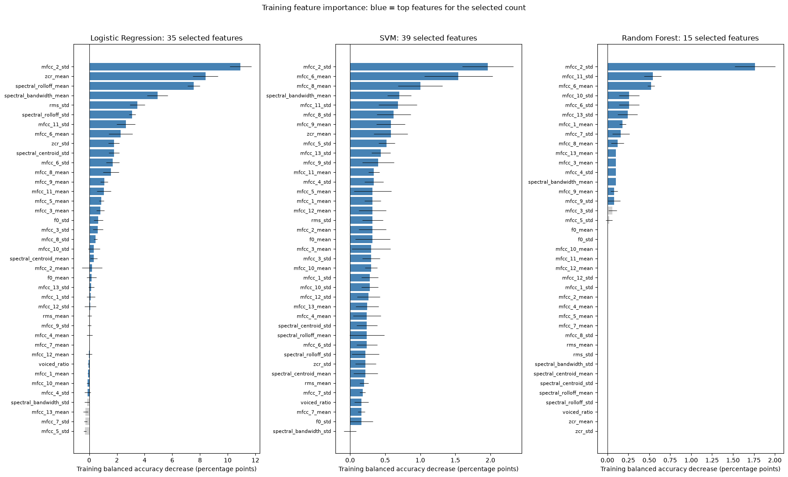
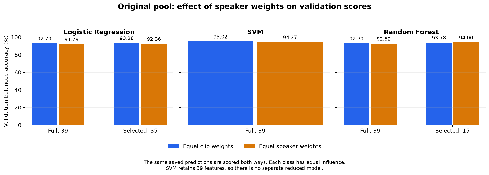

# E1 feature selection and model comparison

Date: 7 October 2026

## 1. Goal and comparison flow

The goal is to select one model for Singapore versus Non-Singapore classification.
Compare Logistic Regression (LR), Support Vector Machine (SVM), and Random Forest (RF).

The report follows this decision sequence:

1. Compare the full 39- and 91-feature pools for each classifier.
2. Compare tested feature counts and identify best feature count for each classifier.
3. Examine feature importance and agreement across speaker folds.
4. Check whether equal speaker weights change the validation result.
5. Combine the evidence for each classifier and select one model.

Use validation balanced accuracy as the main selection score.
Balanced accuracy gives both classes equal influence.
Use speaker-fold results to check consistency and feature count to resolve close choices.
Report test scores as the final comparison, without using them to retune the systems.
A selected count is the result of the notebook's rule. It is not always the count with the highest score.

## 2. Data and feature pools

| Split | Non-Singapore clips | Singapore clips | Non-Singapore speakers | Singapore speakers |
|---|---:|---:|---:|---:|
| Training | 498 | 500 | 150 | 291 |
| Validation | 201 | 201 | 60 | 117 |
| Test | 301 | 299 | 90 | 175 |
| Total | 1,000 | 1,000 | 300 | 583 |

All systems use the same saved speaker split.
No recorded speaker ID occurs in more than one split.

| Feature block | Original pool | Larger pool |
|---|---:|---:|
| MFCC means and standard deviations | 26 | 26 |
| Pitch and estimated voicing | 3 | 3 |
| Spectral means and standard deviations | 6 | 6 |
| Zero-crossing-rate means and standard deviations | 2 | 2 |
| RMS energy means and standard deviations | 2 | 2 |
| MFCC delta means and standard deviations | 0 | 26 |
| MFCC delta-delta means and standard deviations | 0 | 26 |
| Total | 39 | 91 |

MFCC values describe the sound spectrum.
Deltas describe change over time. Delta-deltas describe change in that change.
The added values come from frame-level measurements.

Classifier settings stay fixed during the feature count comparisons.
Thus, the comparisons show the effect of feature selection under those settings.

## 3. Impact of the full feature pool (39 and 91 features)

| Classifier | Pool | Validation balanced accuracy | Combined speaker-fold score | Test balanced accuracy |
|---|---:|---:|---:|---:|
| LR | 39 | 92.79% | 92.07% | 91.18% |
| LR | 91 | 92.29% | 92.71% | 93.17% |
| SVM | 39 | 95.02% | 95.21% | 93.84% |
| SVM | 91 | 95.02% | 94.50% | 93.84% |
| RF | 39 | 92.79% | 91.78% | 93.51% |
| RF | 91 | 91.54% | 91.93% | 93.01% |

**LR:** adding time-change features loses 0.50 validation points but gains 0.64 fold points and 1.99 test points.
The larger pool helps some evaluation stages, but does not improve every score.

**SVM:** the larger pool gives no validation gain.
Its combined fold score is 0.71 points lower.
Both test scores round to 93.84%. Their difference is about 0.002 points.
The original pool provides comparable test accuracy with 52 fewer inputs.

**RF:** the larger pool loses 1.24 validation points and 0.50 test points.
Its small fold gain of 0.15 points does not give consistent support for the added features.

**Conclusion:** The larger pool gives no consistent accuracy gain across classifiers. SVM shows highest accuracy among the three classifiers.

## 4. Impact of reducing feature count

### Testing with 39-feature pool

Rules: The tested counts are 5, 10, 15, 20, 25, 30, 35, and 39.
Select the highest validation score that strictly exceeds the full-set baseline.
An exact tie selects fewer features. If no count improves the baseline, retain 39.

**Figure 1. Feature count comparison.** Circles show selected counts.
Dashed lines show 39 features baselines. The vertical axis starts at 75%.

| Classifier | Selected count | Inputs removed | Validation change from full set | Fold change | Test change |
|---|---:|---:|---:|---:|---:|
| LR | 35 | 10.3% | +0.50 points | +0.14 points | 0.00 points |
| SVM | 39 | 0.0% | 0.00 points | 0.00 points | 0.00 points |
| RF | 15 | 61.5% | +1.00 points | -0.50 points | -2.33 points |

**Conclusion:** LR removes four inputs without losing test accuracy. RF removes many more inputs but loses accuracy, while SVM benefits from retaining all 39.

### Testing with larger 91-feature pool

Rules: The tested counts are 5, 10, 15, 20, 25, 30, 35, 39, 50, 65, 80, and 91.
Select the smallest tested count within one percentage point of the highest validation score.
This rule permits a score loss to reduce input size.

**Figure 2. Larger-pool count comparison.** Selected counts are 25, 65, and 30.
The vertical axis starts at 75%. The curve values use rounded notebook scores.

| Classifier | Highest-scoring tested count(s) | Highest validation score | Selected count | Selected validation score | Inputs removed |
|---|---|---:|---:|---:|---:|
| LR | 25, 50 | 93.53% | 25 | 93.53% | 72.5% |
| SVM | 91 | 95.02% | 65 | 94.03% | 28.6% |
| RF | 30 | 92.79% | 30 | 92.79% | 67.0% |

LR and RF select their highest-scoring tested counts.
SVM selects 65 under the tolerance rule, although all 91 score higher.

| Classifier | Selected count | Validation change from full 91 | Fold change | Test change |
|---|---:|---:|---:|---:|
| LR | 25 | +1.24 points | +0.07 points | -0.83 points |
| SVM | 65 | -1.00 points | -0.64 points | -0.83 points |
| RF | 30 | +1.24 points | -0.86 points | -0.50 points |

All three selected subsets lose test accuracy relative to their own full 91-feature models.
LR has the strongest fold result for reduction in this pool, but its gain is only 0.07 points.

**Conclusion:** All three selected subsets lose test accuracy against their full-pool references. Fewer inputs therefore introduce an accuracy tradeoff rather than a consistent improvement.

### Does the validation gain continue in speaker folds and test data?

Figure 3 shows that validation gains from feature reduction do not consistently continue in speaker folds or test data.

**Figure 3. Effect of feature reduction across evaluation stages.**

## 5. Feature importance and selection agreement

The feature-importance test ranks features by training permutation importance.
It shuffles one feature at a time between training clips and measures the decrease in balanced accuracy.
A larger decrease shows greater model reliance on that feature.
Each feature is shuffled five times. Error bars show variation across those five repeats.

**Figure 4. 39-features pool importance by classifier.** Blue bars mark features within the selected count. The values come from the training-only ranking.

| Classifier | Highest-ranked 39-features pool | Highest-ranked 91-features pool |
|---|---|---|
| LR | `mfcc_2_std`, `zcr_mean`, `spectral_rolloff_mean` | `mfcc_2_std`, `spectral_rolloff_mean`, `zcr_mean` |
| SVM | `mfcc_2_std`, `mfcc_6_mean`, `mfcc_8_mean` | `mfcc_6_mean`, `spectral_bandwidth_mean`, `mfcc_delta_2_mean` |
| RF | `mfcc_2_std`, `mfcc_11_std`, `mfcc_6_mean` | `mfcc_6_mean`, `mfcc_13_mean`, `mfcc_5_std` |

LR: Relies on a mixture of MFCC, spectral, and zero-crossing measurements.
Its 91-feature pool ranking also gives high importance to delta-delta measurements.

SVM: Uses information from several features. Removing lower-ranked features does not improve its original-pool validation score.

RF: 39-feature pool importance is concentrated in a few MFCC values.
However, 91-feature pool training importance does not establish that the remaining features can be removed without a test loss.

The final larger-pool subsets contain:

| Classifier | Original features | Delta features | Delta-delta features | Total |
|---|---:|---:|---:|---:|
| LR | 14 | 3 | 8 | 25 |
| SVM | 25 | 20 | 20 | 65 |
| RF | 29 | 1 | 0 | 30 |

RF's final subset uses almost entirely original measurements.
LR and SVM retain more time-change information.
Appendix A gives all final selected names.

**Conclusion:** Feature importance identifies which features to keep in smaller models. Each classifier is trained with its top 5, 10, 15, and other tested feature counts. The validation scores are then used to select the final feature count.

## 6. Impact of speaker weights

The speaker-weight testing scores the same 39-feature pool validation predictions in two ways.
Equal clip weights give each clip equal influence within its class.
Equal speaker weights give each speaker equal total influence within its class.
For example, a speaker with five clips gives each clip a weight of 0.2. A speaker with one clip gives that clip a weight of 1. Both speakers therefore have a total weight of 1.
This comparison changes scoring only. It does not change model training or predictions.

**Figure 5. Effect of speaker weights.** LR and RF reductions improve validation under both scoring methods.
SVM retains the same 39-feature model.

| Classifier | Count | Equal clip weights | Equal speaker weights | Clip-weight gain from own full 39 | Speaker-weight gain |
|---|---:|---:|---:|---:|---:|
| LR | 39 | 92.79% | 91.79% | 0.00 points | 0.00 points |
| LR | 35 | 93.28% | 92.36% | +0.50 points | +0.57 points |
| SVM | 39 | 95.02% | 94.27% | 0.00 points | 0.00 points |
| RF | 39 | 92.79% | 92.52% | 0.00 points | 0.00 points |
| RF | 15 | 93.78% | 94.00% | +1.00 points | +1.47 points |

**Conclusion:** Speaker weighting lowers validation balanced accuracy for LR, SVM, and RF with all 39 features. Only RF with 15 selected features shows an increase, from 93.78% to 94.00%.

## 7. Combined assessment for each classifier

| Classifier | 39 vs 91 features | Feature reduction | Feature importance | Speaker weighting | Decision |
|---|---|---|---|---|---|
| LR | 91 improves fold and test scores, but lowers validation. | 35 from 39 keeps test accuracy; 25 from 91 loses accuracy against full 91. | The 35-feature subset selects more of the same features across speaker folds than the 25-feature subset. | Lowers validation scores. | A smaller-model option, but not the accuracy leader. |
| SVM | Similar validation and test scores; 39 has better fold results. | Keep all 39. Reducing 91 to 65 lowers accuracy. | Uses several acoustic measurements. | Lowers the score, but SVM still leads at 94.27%. | **Select SVM with 39 features.** |
| RF | 91 lowers validation and test scores. | Both reductions lower fold and test scores. | Relies mainly on MFCC features. | Raises the 15-feature score to 94.00%; lowers the 39-feature score. | Keep 39 as the RF reference; prefer SVM overall. |

**Conclusion:** LR offers reduction candidates, while RF reduction loses accuracy beyond validation. SVM with the original 39 features provides the strongest combined basis for the final choice.

## 8. Final model choice

**Select RBF SVM with all 39 original acoustic features.**

It ties the 91-feature SVM on validation and rounded test accuracy, has the higher speaker-fold score, and uses fewer inputs.
Feature reduction does not improve the original-pool SVM.

| Model | Features | Validation balanced accuracy | Fold score | Test balanced accuracy |
|---|---:|---:|---:|---:|
| **Selected SVM** | **39 original** | **95.02%** | **95.21%** | **93.84%** |
| Full SVM alternative | 91 | 95.02% | 94.50% | 93.84% |
| LR subset | 25 from 91 | 93.53% | 92.78% | 92.34% |
| Full RF reference | 39 original | 92.79% | 91.78% | 93.51% |

Use standard scaling with `C=1.0`, `gamma='scale'`, and `class_weight='balanced'`.
The fitted model is `outputs/e1_feature_study/results/svm_39.joblib` (generated when the study is run).

**Conclusion:** The original 39-feature SVM offers the strongest overall results without the extra inputs of the 91-feature pool.

**Note:** Refer to [Section 2](#2-data-and-feature-pools) for the feature blocks that make up the 39 original feature pool.

## Appendix A. Final saved feature lists

These lists retain the order stored in the selected model files.

### Original 39-feature study

**Logistic Regression: 35 features.**

`zcr_mean`, `mfcc_2_std`, `spectral_rolloff_mean`, `spectral_centroid_mean`, `spectral_bandwidth_mean`, `rms_std`, `spectral_centroid_std`, `mfcc_6_mean`, `mfcc_11_std`, `spectral_rolloff_std`, `zcr_std`, `mfcc_3_mean`, `mfcc_6_std`, `mfcc_9_mean`, `mfcc_8_mean`, `mfcc_5_mean`, `rms_mean`, `mfcc_3_std`, `f0_std`, `mfcc_12_std`, `mfcc_10_std`, `mfcc_11_mean`, `mfcc_9_std`, `mfcc_13_std`, `mfcc_4_mean`, `mfcc_12_mean`, `mfcc_2_mean`, `mfcc_7_std`, `spectral_bandwidth_std`, `mfcc_1_std`, `mfcc_8_std`, `mfcc_7_mean`, `mfcc_13_mean`, `mfcc_5_std`, `mfcc_10_mean`.

Block counts: original: 35, delta: 0, delta-delta: 0.

**SVM: 39 features.**

All 39 original features: 13 MFCC means, 13 MFCC standard deviations, three pitch/voicing values, six spectral values, two zero-crossing-rate values, and two RMS energy values.

**Random Forest: 15 features.**

`mfcc_2_std`, `mfcc_6_mean`, `mfcc_11_std`, `mfcc_10_std`, `mfcc_7_std`, `mfcc_13_std`, `spectral_bandwidth_std`, `mfcc_3_mean`, `mfcc_8_mean`, `mfcc_1_mean`, `mfcc_3_std`, `mfcc_9_std`, `rms_mean`, `spectral_bandwidth_mean`, `mfcc_6_std`.

Block counts: original: 15, delta: 0, delta-delta: 0.

### 91-feature study

**Logistic Regression: 25 features.**

`mfcc_2_std`, `spectral_rolloff_mean`, `zcr_mean`, `mfcc_delta_delta_1_std`, `mfcc_delta_delta_1_mean`, `spectral_bandwidth_mean`, `mfcc_6_mean`, `mfcc_3_std`, `spectral_centroid_std`, `mfcc_9_mean`, `mfcc_delta_delta_3_mean`, `spectral_rolloff_std`, `rms_std`, `mfcc_11_std`, `mfcc_delta_8_std`, `mfcc_delta_delta_13_std`, `mfcc_delta_delta_2_mean`, `mfcc_12_std`, `mfcc_delta_delta_8_std`, `mfcc_delta_delta_10_std`, `mfcc_8_std`, `mfcc_delta_7_std`, `mfcc_delta_delta_6_std`, `mfcc_delta_2_std`, `mfcc_8_mean`.

Block counts: original: 14, delta: 3, delta-delta: 8.

**SVM: 65 features.**

`mfcc_delta_delta_1_std`, `mfcc_6_mean`, `mfcc_2_std`, `spectral_bandwidth_mean`, `mfcc_8_mean`, `mfcc_12_mean`, `mfcc_delta_2_mean`, `mfcc_delta_9_mean`, `mfcc_delta_1_std`, `mfcc_delta_3_std`, `mfcc_delta_4_mean`, `mfcc_delta_8_mean`, `mfcc_delta_10_mean`, `mfcc_delta_delta_10_mean`, `mfcc_3_mean`, `mfcc_5_std`, `mfcc_delta_delta_12_mean`, `spectral_bandwidth_std`, `mfcc_13_mean`, `mfcc_4_std`, `mfcc_3_std`, `mfcc_delta_delta_5_mean`, `mfcc_2_mean`, `mfcc_delta_8_std`, `mfcc_1_mean`, `mfcc_delta_delta_8_mean`, `mfcc_7_mean`, `mfcc_delta_1_mean`, `mfcc_delta_delta_5_std`, `rms_std`, `mfcc_delta_13_mean`, `mfcc_13_std`, `mfcc_5_mean`, `mfcc_delta_12_std`, `mfcc_delta_3_mean`, `mfcc_delta_delta_11_mean`, `mfcc_delta_delta_12_std`, `mfcc_delta_delta_3_std`, `mfcc_delta_delta_7_mean`, `mfcc_delta_delta_7_std`, `rms_mean`, `mfcc_delta_delta_2_std`, `mfcc_delta_delta_9_std`, `mfcc_delta_11_mean`, `mfcc_delta_2_std`, `mfcc_delta_delta_4_mean`, `mfcc_10_mean`, `spectral_centroid_mean`, `mfcc_delta_12_mean`, `mfcc_delta_6_mean`, `mfcc_delta_delta_13_mean`, `mfcc_delta_delta_4_std`, `mfcc_9_std`, `mfcc_11_std`, `mfcc_delta_9_std`, `f0_mean`, `mfcc_delta_4_std`, `mfcc_delta_5_mean`, `mfcc_delta_7_mean`, `mfcc_delta_delta_8_std`, `mfcc_delta_delta_9_mean`, `zcr_mean`, `mfcc_delta_delta_1_mean`, `mfcc_delta_delta_2_mean`, `spectral_rolloff_mean`.

Block counts: original: 25, delta: 20, delta-delta: 20.

**Random Forest: 30 features.**

`mfcc_2_std`, `mfcc_6_mean`, `mfcc_11_std`, `mfcc_13_mean`, `mfcc_13_std`, `mfcc_4_std`, `mfcc_10_std`, `mfcc_1_mean`, `mfcc_3_mean`, `mfcc_5_std`, `spectral_bandwidth_std`, `mfcc_7_std`, `mfcc_9_mean`, `f0_std`, `mfcc_delta_11_std`, `f0_mean`, `mfcc_10_mean`, `mfcc_11_mean`, `mfcc_12_mean`, `mfcc_12_std`, `mfcc_1_std`, `mfcc_2_mean`, `mfcc_3_std`, `mfcc_4_mean`, `mfcc_5_mean`, `mfcc_6_std`, `mfcc_7_mean`, `mfcc_8_mean`, `mfcc_8_std`, `mfcc_9_std`.

Block counts: original: 29, delta: 1, delta-delta: 0.
